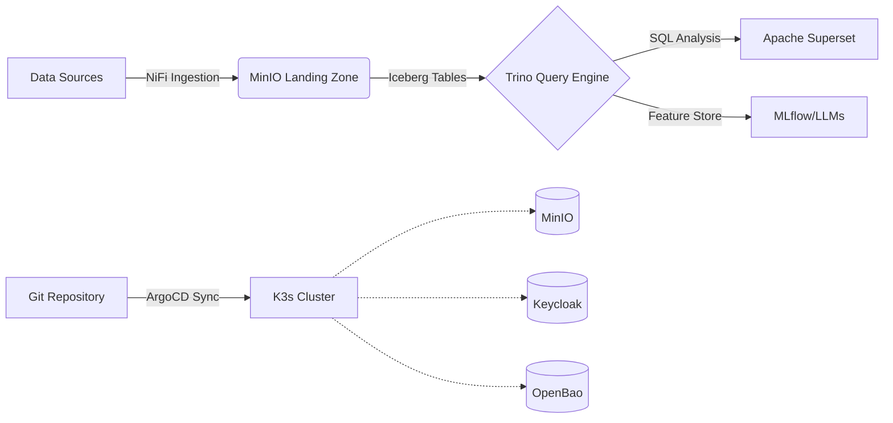

# SDP Architecture Overview

## 1. Vision

The Sovereign Data Platform (SDP) is a reference architecture for building **GDPR-compliant**, **cloud-agnostic**, and **fully open-source** data platforms. 

It is designed to eliminate vendor lock-in while providing the robustness required for enterprise-grade BI, ML, and AI workloads.

> **Current Status:** This document describes the target architecture. The implementation is currently in "Build-in-Progress" phase as a personal Proof-of-Concept to validate design decisions before client deployment.

---

## 2. Core Principles

### 2.1 Cloud Agnosticism

The platform must run on any infrastructure:

- **Kubernetes:** K3s (edge/lightweight) or standard K8s distributions.
- **Infrastructure:** Bare metal, On-prem servers, or EU-region cloud instances (AWS/Azure/GCP).
- **No Vendor Lock-in:** No proprietary dependencies that prevent migration.

### 2.2 EU-First Sovereignty

- **Data Residency:** Strict enforcement that data never leaves EU borders.
- **Key Control:** Encryption keys are managed via self-hosted OpenBao (not cloud provider KMS).
- **Auditability:** Full immutable audit trails for every pipeline change via GitOps.

### 2.3 Immutable Infrastructure

- **Infrastructure as Code (IaC):** Everything defined in OpenTofu/Terraform. No manual server changes.
- **GitOps:** ArgoCD ensures cluster state always matches the Git repository state.
- **Reproducibility:** Pipelines are defined as pure functions (Input A → Output B), ensuring consistent results.

---

## 3. Technology Stack

| Layer              | Component              | Role                                                | License    |
|:------------------ |:---------------------- |:--------------------------------------------------- |:---------- |
| **Orchestration**  | Kubernetes (K3s/K8s)   | Container runtime & scheduling                      | Apache 2.0 |
| **IaC**            | OpenTofu               | Infrastructure provisioning                         | MPL 2.0    |
| **GitOps**         | ArgoCD                 | Declarative deployment sync                         | Apache 2.0 |
| **Storage**        | MinIO + Apache Iceberg | S3-compatible object storage with ACID transactions | Apache 2.0 |
| **Ingestion**      | Apache NiFi            | Data logistics, routing, PII masking                | Apache 2.0 |
| **Compute**        | Apache Spark / Trino   | Batch processing & Federated SQL                    | Apache 2.0 |
| **Transformation** | dbt Core               | SQL-based modeling & testing                        | Apache 2.0 |
| **Security**       | Keycloak + OpenBao     | IAM & Secrets Management                            | Apache 2.0 |
| **BI**             | Apache Superset        | Visualization & Dashboards                          | Apache 2.0 |

### Why These Choices?

- **Open Source Neutrality:** Preference for Linux Foundation projects and community-driven forks (OpenTofu instead of Terraform, OpenBao instead of Vault).
- **Functional First:** Leveraging Scala and pure functions for predictable, testable data pipelines.
- **Modern Lakehouse:** Using Iceberg to bring ACID transactions to low-cost object storage, avoiding expensive proprietary data warehouses.

---

## 4. Reference Implementation Flow

## 5. Compliance & Security Strategy

### 5.1 Data Governance

- **Lineage:** Automated tracking using OpenLineage standards.
- **Quality:** Data quality gates embedded in NiFi/Spark flows (Great Expectations/Soda Core).
- **Quarantine:** Invalid or PII-leaking data automatically isolated in quarantine buckets.

### 5.2 Access Control

- **Identity:** Centralized via Keycloak (OIDC/SAML).
- **Secrets:** Dynamic secrets injected via OpenBao agent sidecars.
- **Network:** Zero-trust networking enforced via Cilium eBPF policies.

## 6. Next Steps (Roadmap)

✅ Phase 1: Define Architecture & Documentation (Current)
⏳ Phase 2: Bootstrap K3s Cluster & Install Core Services (MinIO, Keycloak, OpenBao)
⏳ Phase 3: Implement Ingestion Pipeline (NiFi → MinIO)
⏳ Phase 4: Add Compute Layer (Trino/Spark) & BI (Superset)
⏳ Phase 5: Hardening & Compliance Module Validation
Document Owner: Dan Kjeldstrøm Hansen | Last Updated: June 2026 EOF
